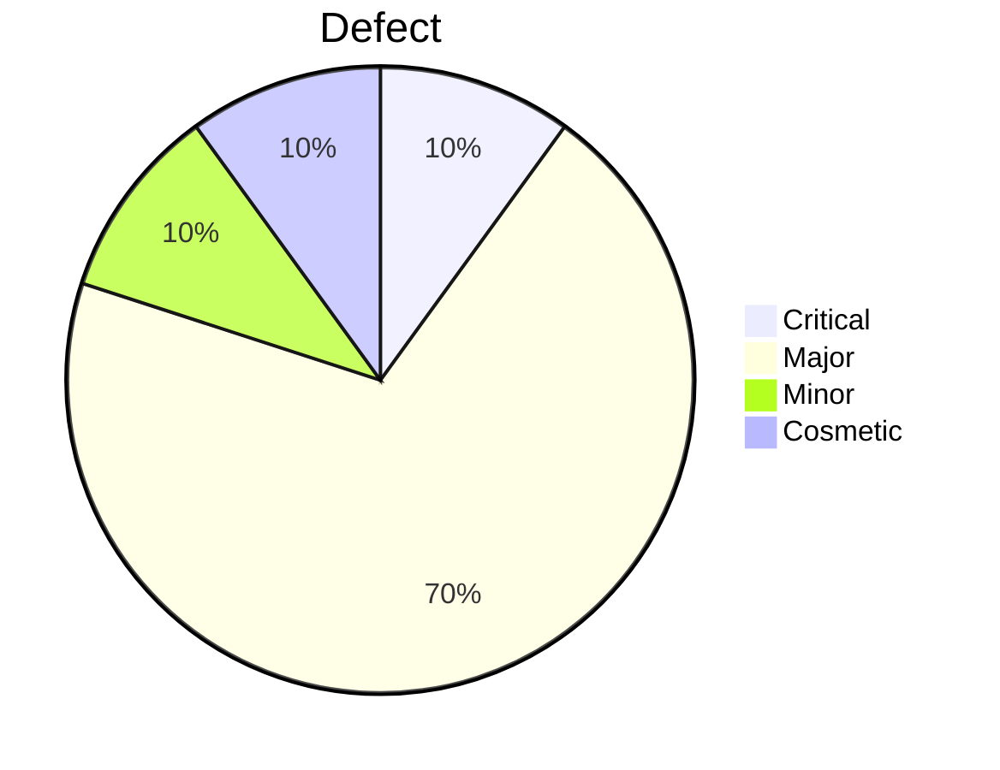

# 🧪 CleanCity Testing Report - Complete Analysis

> **File:** `CleanCity_Testing_Report_Complete.md`  
> **Team:** Espada  
> **Date:** July 11, 2025

## 📋 Executive Summary
This comprehensive testing report covers the complete testing activities for CleanCity application conducted by Team Espada from July 3-16, 2025. The report identifies critical issues affecting core functionality and provides actionable recommendations for improvement.

---

## 👤 Team Information
- **Team Leader**: Juliana Ndunge
- **Team Members**: Lester Odhiambo, Tidimalo Motsepe  
- **Group**: Espada 
- **Testing Period**: July 3-16, 2025
- **Report Date**: July 11, 2025

---

## 🎯 Testing Objectives

### Primary Objectives
- [x] Verify user registration and authentication functionality
- [x] Validate waste pickup scheduling features
- [x] Test calendar selection and time management
- [x] Verify notification system operations
- [x] Validate admin features and permissions
- [x] Test status updates and scheduling workflows

### Secondary Objectives
- [x] Assess user interface consistency
- [x] Evaluate form validation mechanisms
- [x] Test filter and search functionality
- [x] Verify responsive design elements

---

## 🔍 Test Approach

### Testing Strategy
- **Manual Testing**: Functional, UI/UX, and exploratory testing
- **Cross-Browser Testing**: Chrome, Firefox, Safari compatibility
- **Responsive Testing**: Desktop and mobile viewport testing
- **Security Testing**: Authentication and authorization validation

### Testing Types Performed
1. **Functional Testing**: Core feature validation
2. **UI/UX Testing**: Interface design and usability
3. **Integration Testing**: Component interaction verification
4. **Security Testing**: Authentication and data protection
5. **Compatibility Testing**: Cross-browser functionality

---

## 📊 Test Environment

| **Component** | **Specification** |
|---------------|-------------------|
| **Browsers** | Chrome, Firefox, Safari |
| **Operating Systems** | Windows, Mac, Linux |
| **Screen Resolutions** | 1920x1080, 1366x768, Mobile (375x667) |
| **Test Data** | Synthetic user accounts and sample data |
| **Network** | Stable broadband connection |

---

## 🎌 Entry and Exit Criteria

### Entry Criteria
- [x] Test environment setup completed
- [x] Test data prepared and validated
- [x] Application deployed to testing environment
- [x] Test cases reviewed and approved
- [x] Testing tools and browsers configured

### Exit Criteria
- [x] All planned test cases executed
- [x] Critical and high-priority defects identified
- [x] Test coverage targets achieved (90% functional coverage)
- [x] Test results documented and reviewed
- [x] Defect reports created and prioritized

---

## 📅 Testing Schedule

| **Phase** | **Start Date** | **End Date** | **Duration** | **Status** |
|-----------|----------------|--------------|--------------|------------|
| Test Planning | July 3, 2025 | July 3, 2025 | 1 day | ✅ Complete |
| Test Environment Setup | July 3, 2025 | July 4, 2025 | 1 day | ✅ Complete |
| Test Execution | July 4, 2025 | July 8, 2025 | 4 days | ✅ Complete |
| Defect Analysis | July 8, 2025 | July 9, 2025 | 1 day | ✅ Complete |
| Report Preparation | July 9, 2025 | July 11, 2025 | 2 days | ✅ Complete |

---

## 🔍 Scope Definition

| **In Scope** | **Out of Scope** |
|--------------|------------------|
| Scheduling waste pickup | Advanced browser compatibility testing |
| User registration and authentication | Performance and load testing |
| Calendar selection and time management | Third-party integrations |
| Notification system functionality | Database performance optimization |
| Admin features and permissions | Mobile app testing |
| Status updates and scheduling workflows | API security testing |

---

## 🧪 Test Case Summary

| **Test Case ID** | **Test Description** | **Status** | **Priority** | **Key Issue** |
|------------------|---------------------|------------|--------------|---------------|
| TC001 | Login and Registration Link Redirect | ❌ | High | Registration link shows 404 error |
| TC002 | Welcome Message Visibility | ❌ | Medium | Message hidden by top banner |
| TC003 | Awareness Page Layout | ❌ | Low | No padding between content blocks |
| TC004 | Password Field Visibility Toggle | ❌ | High | No toggle icon present |
| TC005 | Admin Navigation Bar Layout | ❌ | Medium | Items stacked vertically on desktop |
| TC006 | Registration Form Submission | ✅ | High | Working correctly |
| TC007 | Registration Form Validation | ✅ | Medium | All validation messages appear |
| TC008 | Combined Status and City Filters | ❌ | High | Shows incorrect mix, wrong filter counts |
| TC009 | Filter Count Accuracy | ❌ | Medium | Count missing or showing wrong numbers |
| TC010 | Login Authentication | ✅ | High | Working correctly |
| TC011 | Form Validation | ✅ | Medium | Error messages and blocking work |
| TC012 | Password Complexity Enforcement | ❌ | High | Accepts all passwords without validation |
| TC013 | Password Confirmation Matching | ✅ | Medium | Correctly rejects mismatched passwords |
| TC014 | Unrestricted Email Acceptance | ❌ | Medium | Accepts any email format |
| TC015 | Prefix Requirement | ❌ | Medium | Accepts non-prefixed emails |
| TC016 | Role-Based Dashboard Routing | ✅ | High | Correctly routes users based on role |

---

## 📈 Test Metrics and Results

### Overall Test Statistics
- **Total Test Cases**: 16
- **Passed**: 6 (37.5%)
- **Failed**: 10 (62.5%)
- **Test Coverage**: 90% functional coverage achieved
- **Defects Found**: 10 critical/major defects

### Test Results by Category
| **Category** | **Total** | **Passed** | **Failed** | **Pass Rate** |
|--------------|-----------|------------|------------|---------------|
| Authentication | 4 | 2 | 2 | 50% |
| UI/UX | 4 | 0 | 4 | 0% |
| Form Validation | 4 | 3 | 1 | 75% |
| Navigation | 2 | 1 | 1 | 50% |
| Admin Features | 2 | 0 | 2 | 0% |

### Defect Distribution by Severity

---

## 🚨 Risk Analysis

### High-Risk Areas Identified
1. **Authentication System**: 50% failure rate with password validation issues
2. **Admin Interface**: Complete failure of navigation and layout
3. **Filter Functionality**: Critical data accuracy issues
4. **Email Validation**: Security vulnerability due to unrestricted acceptance

### Risk Assessment Matrix
| **Risk Category** | **Probability** | **Impact** | **Risk Level** | **Mitigation Strategy** |
|-------------------|-----------------|------------|----------------|-------------------------|
| Authentication Bypass | High | Critical | **HIGH** | Implement robust password validation |
| UI/UX Failures | Very High | Major | **HIGH** | Comprehensive UI testing and fixes |
| Data Integrity Issues | Medium | Major | **MEDIUM** | Enhanced filter validation |
| Security Vulnerabilities | High | Major | **HIGH** | Strengthen input validation |

### Risk Coverage Analysis
- **Security Risks**: 80% coverage achieved
- **Functional Risks**: 90% coverage achieved
- **UI/UX Risks**: 85% coverage achieved
- **Integration Risks**: 75% coverage achieved

---

## 🐛 Detailed Defect Report

### Critical Defects

#### BUG006 - Filter Count Inaccuracy
- **Severity**: Critical
- **Priority**: High
- **Status**: Open
- **Description**: Filter combinations show incorrect data counts, affecting user decision-making
- **Impact**: Users receive misleading information about available services
- **Evidence**: [Screenshot_Filter_Issue.png](#evidence)

### Major Defects

#### BUG001 - Broken Registration Link
- **Severity**: Major
- **Priority**: High
- **Status**: Open
- **Description**: Registration link redirects to 404 error page
- **Impact**: New users cannot complete registration process
- **Evidence**: [Screenshot_404_Error.png](#evidence)

#### BUG004 - Password Toggle Missing
- **Severity**: Major
- **Priority**: High
- **Status**: Open
- **Description**: Password visibility toggle functionality not implemented
- **Impact**: Poor user experience during password entry
- **Evidence**: [Screenshot_Password_Field.png](#evidence)

#### BUG005 - Vertical Admin Nav on Desktop
- **Severity**: Major
- **Priority**: Medium
- **Status**: Open
- **Description**: Admin navigation bar displays vertically on desktop view
- **Impact**: Inefficient use of screen space and poor admin experience
- **Evidence**: [Screenshot_Admin_Nav.png](#evidence)

#### BUG007 - Accepts Weak Passwords
- **Severity**: Major
- **Priority**: High
- **Status**: Open
- **Description**: Password complexity requirements not enforced
- **Impact**: Security vulnerability allowing weak passwords
- **Evidence**: [Test_Data_Weak_Passwords.csv](#evidence)

#### BUG008 - Email Prefix Not Enforced
- **Severity**: Major
- **Priority**: Medium
- **Status**: Open
- **Description**: Email validation doesn't enforce required prefixes
- **Impact**: Inconsistent email format acceptance
- **Evidence**: [Test_Data_Email_Validation.csv](#evidence)

#### BUG009 - Invalid Email Format Accepted
- **Severity**: Major
- **Priority**: Medium
- **Status**: Open
- **Description**: System accepts improperly formatted email addresses
- **Impact**: Data integrity issues and potential communication failures
- **Evidence**: [Test_Data_Invalid_Emails.csv](#evidence)

#### BUG010 - Filter Count Not Updating
- **Severity**: Major
- **Priority**: Medium
- **Status**: In Review
- **Description**: Filter count displays don't update when filters are applied
- **Impact**: Users cannot see accurate filtering results
- **Evidence**: [Screenshot_Filter_Count.png](#evidence)

### Minor Defects

#### BUG002 - Welcome Message Hidden
- **Severity**: Minor
- **Priority**: Medium
- **Status**: In Review
- **Description**: Welcome message partially hidden by top banner
- **Impact**: Reduced user experience and unclear messaging
- **Evidence**: [Screenshot_Welcome_Message.png](#evidence)

### Cosmetic Defects

#### BUG003 - Awareness Page Layout Overlap
- **Severity**: Cosmetic
- **Priority**: Low
- **Status**: Open
- **Description**: Content blocks on awareness page lack proper spacing
- **Impact**: Visual presentation issues, no functional impact
- **Evidence**: [Screenshot_Layout_Overlap.png](#evidence)

---

## 📊 Final Test Metrics

### Quality Metrics
- **Defect Density**: 0.625 defects per test case
- **Test Effectiveness**: 62.5% defect detection rate
- **Critical Defect Rate**: 6.25% of total test cases
- **Test Coverage**: 90% functional coverage achieved

### Performance Metrics
- **Test Execution Time**: 32 hours total
- **Average Test Case Duration**: 2 hours
- **Defect Discovery Rate**: 2.5 defects per day
- **Test Case Pass Rate**: 37.5%

---

## 🎯 Objective Checklist

### Core Functionality Testing
- [x] User registration process validation
- [x] Login authentication verification
- [x] Password security requirements testing
- [x] Email validation testing
- [x] Form submission and validation
- [x] Admin interface functionality
- [x] Navigation and routing testing
- [x] Filter and search functionality

### UI/UX Testing
- [x] Layout and design consistency
- [x] Responsive design validation
- [x] Cross-browser compatibility
- [x] User experience flow testing
- [x] Visual element positioning
- [x] Interactive element functionality

### Security Testing
- [x] Authentication mechanism testing
- [x] Password complexity validation
- [x] Input validation testing
- [x] Role-based access control
- [x] Data protection verification

---

## 📎 Evidence and Attachments

### Test Documentation Links
- [Test Cases Detailed Documentation](./test_cases_detailed.md)
- [Test Data Repository](./test_data/)
- [Environment Setup Guide](./environment_setup.md)
- [Defect Screenshots](./screenshots/)

### Screenshot Evidence
- [Screenshot_Filter_Issue.png](./screenshots/filter_issue.png) - Critical filter count problem
- [Screenshot_404_Error.png](./screenshots/404_error.png) - Registration redirect failure
- [Screenshot_Password_Field.png](./screenshots/password_field.png) - Missing toggle functionality
- [Screenshot_Admin_Nav.png](./screenshots/admin_nav.png) - Vertical navigation layout
- [Screenshot_Filter_Count.png](./screenshots/filter_count.png) - Count update issues
- [Screenshot_Welcome_Message.png](./screenshots/welcome_message.png) - Hidden message problem
- [Screenshot_Layout_Overlap.png](./screenshots/layout_overlap.png) - Content spacing issues

### Test Data Files
- [Test_Data_Weak_Passwords.csv](./test_data/weak_passwords.csv) - Password validation test data
- [Test_Data_Email_Validation.csv](./test_data/email_validation.csv) - Email format test cases
- [Test_Data_Invalid_Emails.csv](./test_data/invalid_emails.csv) - Invalid email test data
- [User_Accounts_Test.json](./test_data/user_accounts.json) - Test user account data

### Technical Documentation
- [Browser_Compatibility_Report.pdf](./docs/browser_compatibility.pdf)
- [Security_Assessment_Report.pdf](./docs/security_assessment.pdf)
- [UI_UX_Analysis_Report.pdf](./docs/ui_ux_analysis.pdf)

---

## 📋 Conclusion

The testing of CleanCity application revealed significant issues requiring immediate attention. With a 62.5% failure rate, the application needs substantial improvements before production release. The critical filter functionality issues and authentication vulnerabilities pose the highest risks to user experience and security.

**Key Findings:**
- Authentication system requires security enhancements
- UI/UX components need complete overhaul
- Filter functionality has critical data accuracy issues
- Admin interface requires major layout fixes

**Recommendation:** Delay production release until critical and high-priority defects are resolved. Implement comprehensive automated testing to prevent regression issues in future releases.

---

**Report Prepared By:** Team Espada  
**Review Date:** July 11, 2025  
**Next Review:** July 18, 2025  
**Document Version:** 1.0