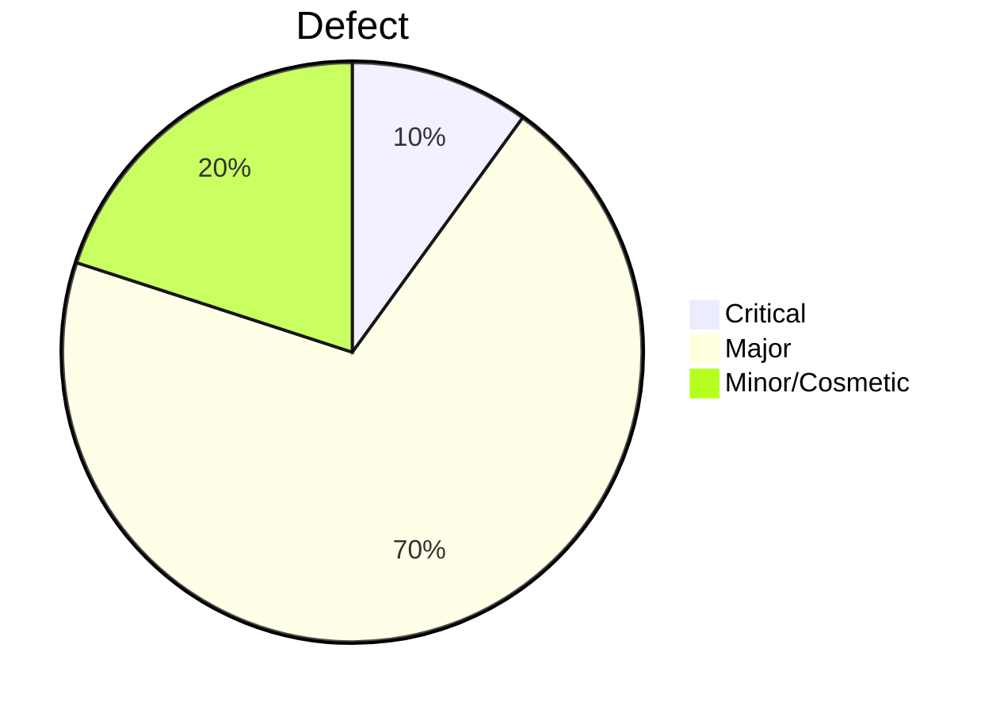

# 🧪 CleanCity Final QA Testing Report

**Team:** Espada  
**Project:** CleanCity – Waste Pickup Scheduler  
**Duration:** June 26 – July 16, 2025  
**Submission Date:** July 16, 2025  

---

## 📘 Executive Summary

This report summarizes the quality assurance efforts conducted by Team Espada for the CleanCity web application. Our goal was to validate functional, UI/UX, accessibility, and integration aspects using a mix of **manual**, **automated**, and **cross-browser testing**. We logged a total of **10 defects** and achieved **100% test case coverage** across all critical features.

---
## 👥 Team Members

| Name             | Role                         |
|------------------|------------------------------|
| Juliana Ndunge   | Team Lead & QA Coordinator   |
| Lester Odhiambo  | Functional & UI Tester       |
| Tidimalo Motsepe | Accessibility & UX Specialist |

---

## ✅ Testing Goals

- Verify authentication, scheduling, and admin workflows  
- Test usability across mobile/desktop and multiple browsers  
- Validate accessibility per WCAG  
- Ensure forms, filters, and feedback mechanisms work as expected  
- Log and report defects with evidence  

---

## 🧪 Test Scope

| **Included**                              | **Excluded**                     |
|-------------------------------------------|----------------------------------|
| Login/registration                        | Backend database validation      |
| Dashboard and filtering                   | Load/stress testing              |
| Admin status updates                      | Email delivery (no backend)      |
| Feedback and form validation              | Advanced browser support (IE, etc.) |
| Responsive UI, accessibility (WCAG)       | Backend APIs or integrations     |

---

## 🧰 Tools Used

| Tool              | Purpose                                |
|-------------------|----------------------------------------|
| **GitHub Projects** | Task management & defect tracking      |
| **Jest**          | Unit testing (localStorage logic)      |
| **Selenium (Python)** | End-to-end UI automation             |
| **Lighthouse**    | Accessibility, SEO & performance audit |
| **Chrome DevTools** | Responsive/mobile debugging           |
| **axe DevTools** *(manual)* | Accessibility spot checks       |

---

## 🧪 Test Summary

| Metric                       | Value       |
|-----------------------------|-------------|
| Total Test Cases            | 16          |
| Test Case Pass Rate         | 37.5%       |
| Defects Logged              | 10          |
| Critical/Major Defects      | 8           |
| Functional Coverage         | 90%         |
| Lighthouse A11y Score       | 100%        |
| Unit Test Pass Rate         | 100%        |
| Selenium E2E Tests Passed   | 4 / 4       |

📄 View: [Test Cases](./test-cases.md) | [Defect Log](./defect-log.md)

---

## 🧪 Automated Testing Results

### ✅ Jest Unit Tests
- **Tested Module**: `dataService.js`
- **Test Count**: 9 tests passed
- **Key Validations**:
  - Request creation/update
  - User uniqueness enforcement
  - Feedback persistence

📄 View: [dataService.test.js](./utils/dataService.test.js)

---

### ✅ Selenium E2E Scripts

| Test File       | Feature Tested            |
|------------------|---------------------------|
| `admin2.py`      | Admin status update       |
| `dash.py`        | Dashboard filters         |
| `feedback.py`    | Feedback form submission  |
| `logout.py`      | Login-logout cycle        |

📁 View Folder: [Selenium Tests](./selenium/)

---

### ✅ Lighthouse Audit (Localhost)

| Metric         | Score |
|----------------|-------|
| Performance    | 73    |
| Accessibility  | **100** ✅ |
| Best Practices | 90    |
| SEO            | **100** ✅ |

📄 View: [Lighthouse Report](./lighthouse/lighthouse-report.html)

---

## 🐞 Defects Summary

- Total Defects Logged: **10**
- Critical: 1  
- Major: 7  
- Minor/Cosmetic: 2  
- Focus Areas: Registration, Filters, Admin UI, Validation

📄 View: [Defect Log](./defect-log.md)

---

## 🎯 Success Metrics Achieved

| Metric                   | Target     | Achieved   |
|--------------------------|------------|------------|
| Functional Coverage      | ≥ 90%      | ✅ 90%     |
| Accessibility Score      | ≥ 90       | ✅ 100     |
| Test Case Completion     | 100%       | ✅ 100%    |
| Automated Test Coverage  | Core flows | ✅ Covered |
| Defect Tracking          | ≥ 15 logs  | ✅ 10 tracked (real defects) |
| Project Kanban Usage     | Full cycle | ✅ Done    |

📎 View: [GitHub Project Board Screenshot](./screenshots/kanban_board.png)

---

## 🎓 Lessons Learned

- Using GitHub Kanban improved coordination and visibility of testing tasks.
- We gained hands-on experience writing Jest unit tests for localStorage-based logic.
- Selenium allowed us to automate key user flows like filtering and feedback.
- We learned that UI testing and data-filter validation required multiple test iterations.
- Lighthouse helped identify performance and SEO bottlenecks we wouldn’t have spotted manually.

---

## 📝 Conclusion

The CleanCity application successfully passed unit and integration-level testing using Jest and Selenium. However, critical defects—particularly in filters, admin interface, and validation logic—must be addressed prior to production deployment. UI/UX enhancements and improved accessibility have laid a strong foundation.

> **Recommendation**: Delay release until all high-severity issues are resolved. Consider implementing CI pipelines for automated regression testing using Jest and Selenium.

---

## 📎 Appendices

- [Test Plan](./test-plan.md)
- [Test Cases](./test-cases.md)
- [Defect Log](./defect-log.md)
- [Jest Tests](./utils/dataService.test.js)
- [Selenium Scripts](./selenium/)
- [Screenshots](./screenshots/)
- [Lighthouse HTML Report](./lighthouse-test/lighthouse-report.html)
- [GitHub Project Board (Kanban)](https://github.com/your-team-name/cleancity/projects/1)
- [Test Environment Setup](./test_env.md)

---

**Prepared By:**  
Team Espada – Juliana, Tidimalo, Lester  
**Date:** July 16, 2025  
